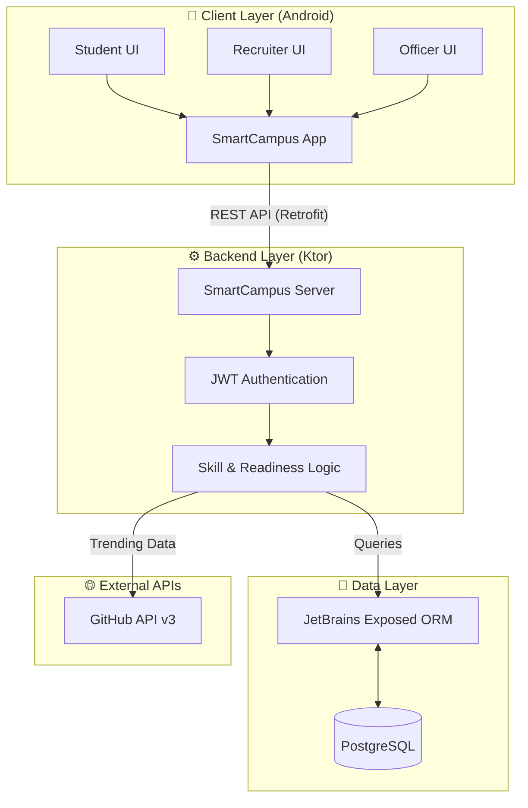

<div align="center">

# 🎓 SmartCampus

**An Intelligent Career Acceleration Platform**

[](#)
[](#)
[](#)
[](#)

*Bridging the gap between academic learning and industry placement through data-driven guidance, skill gap analysis, and placement management.*

</div>

---

## ✨ Key Features

| Feature | Description |
| :--- | :--- |
| 🗺️ **Interactive Skill Map** | Real-time regional demand visualization across 16 tech hubs. |
| 🛤️ **Personalized Roadmaps** | Semester-wise learning paths tailored to current industry trends. |
| 📄 **Resume Builder** | Integrated tools with an ATS (Applicant Tracking System) scorer for placement prep. |
| 🔔 **Mass Notifications** | Real-time broadcasts for placement drives and crucial updates. |

---

## 🏗️ System Architecture

SmartCampus uses a robust Client-Server Architecture. Below is an interactive map of how data flows through the system.



---

## 🛠️ Technology Stack

### 📱 Mobile (Frontend)

- **Language**: Kotlin
- **UI**: XML (Material Design)
- **Networking**: Retrofit 2, Gson
- **Maps**: WebView + Leaflet.js

### ⚙️ Server (Backend)

- **Framework**: Ktor (Kotlin)
- **Database ORM**: JetBrains Exposed
- **Security**: JWT (JSON Web Tokens)
- **Serialization**: Kotlinx Serialization
- **External API**: GitHub API v3 (via Ktor Client)

---

## 🧠 Core "Smart" Logic

### 📈 GitHub Trend Analysis
The system actively researches industry trends by:
1. **Scraping**: Searching GitHub for repos with >5,000 stars updated recently.
2. **Extracting**: Identifying dominant programming languages and topics.
3. **Scoring**: Normalizing star counts into a **Demand Score (50% - 98%)**.
4. **Mapping**: Distributing global trends across Indian tech hubs on an interactive map.

### 🎯 Placement Readiness
Calculates a **Readiness %** by comparing a student's current skills against real-world demand (via GitHub API) and historical placement data.

---

## 📂 Folder Structure

Explore the codebase structure:

### 📁 SmartCampusBackend/ (The Brain)

- `src/main/kotlin/` - **The Brain:** Contains 100% of the logic.
  - `Application.kt` - **The Entry Point:** The "Power Button" of your server.
  - `SeedData.kt` - **The Librarian:** Populates the database with default data.
  - `SkillService.kt` - **The Skill Engine:** Calculates "Readiness %" and regional trends.
  - `GitHubTrendingService.kt` - **The Researcher:** Surfs GitHub for global trends.
- `src/main/resources/` - **The Settings:** 
  - `application.conf` - Database credentials, port numbers, and security keys.

### 📁 SmartCampusApp/ (The Face)

- `app/src/main/` - **The Core App:** Android code (Kotlin) and Layouts (XML).
- `SmartCampusApi.java` - **The Phonebook:** Central list of all API endpoints.
- `build.gradle` - **The Recipe:** Required libraries (Retrofit, Gson, etc.).
- `local.properties` - **Personal Path:** Android SDK path for local machine.

---

## 🚀 Getting Started

### 📋 Prerequisites
- **JDK 17**
- **Android Studio**
- **PostgreSQL** running locally or remotely

### ⚙️ 1. Backend Setup (Ktor)
1. Navigate into the backend directory: `cd SmartCampusBackend/`
2. Update `src/main/resources/application.conf` with your PostgreSQL credentials and JWT Secret.
3. Run the server using Gradle:
   ```bash
   ./gradlew run
   ```

### 📱 2. Frontend Setup (Android)
1. Open the `SmartCampusApp` folder in **Android Studio**.
2. Locate the network configurations (usually inside `build.gradle` or API client config) and update the IP to match your local network (e.g., `http://192.168.0.x:8080/api/`).
3. Click **Sync Project with Gradle Files**.
4. Select your emulator or connected device and click **Run**.

---


<div align="center">
<i>Built with ❤️ for accelerating student careers.</i>
</div>
